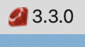

# RubyIconMenuBar

RubyIconMenuBar is a macOS application that displays the current Ruby version in the system menu bar. It utilizes rbenv to monitor changes in the Ruby environment.

## Features

- Displays the current Ruby version in the macOS menu bar.
- Allows quick access to the [ruby-lang.org](https://www.ruby-lang.org/ja) website.
- Simple and lightweight.

## Screenshots



## Getting Started

1. Clone the repository:

```bash
git clone https://github.com/YumaYX/RubyIconMenuBar.git
cd RubyIconMenuBar
open RubyIconMenuBar.xcodeproj
```

2. Archive the App
   In Xcode, go to `Product` > `Archive` to create an archive of the app.

3. Export
   Click the "Distribute App" button, then choose "Copy App(Export a copy of the archived app)"

## Usage

* Click to access additional options, such as opening the Ruby-lang website or quitting the application.

```sh
rbenv global system
rbenv global 3.3.0
```
